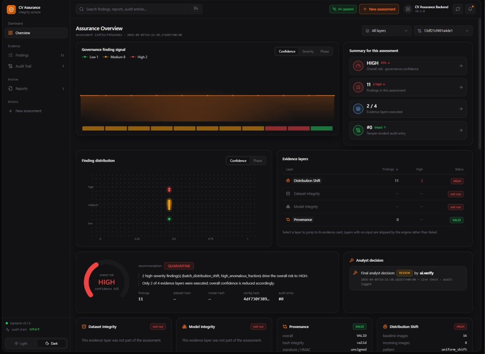
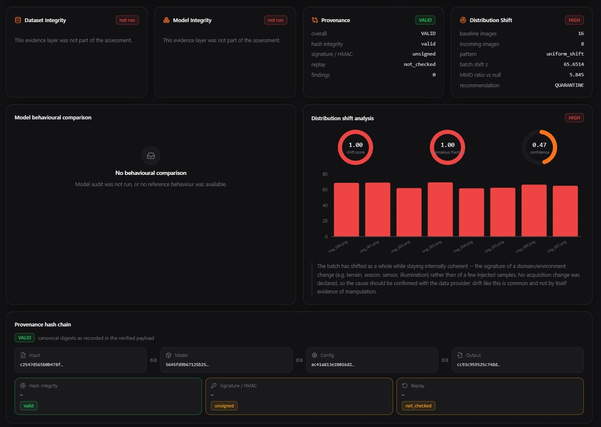
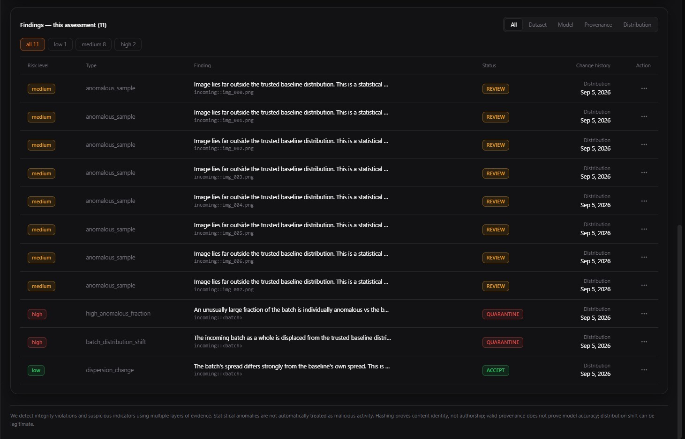
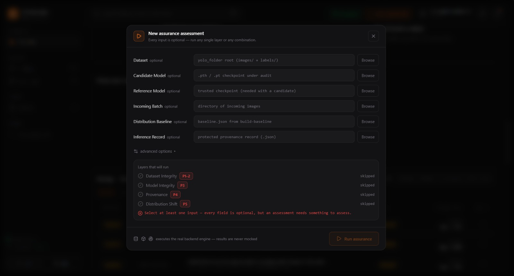

# CV Auditor — Computer Vision Assurance Platform

<p align="center">
  <b>Trustworthy Computer Vision Integrity, Provenance & Distribution Assurance</b><br>
  <sub>Multi-layer auditing platform with an analyst-focused web console</sub>
</p>

<p align="center">


</p>

---

## 📌 Overview

**CV Auditor** is a local, multi-layer assurance platform for investigating the integrity and reliability of computer-vision pipelines.

Instead of treating a model's prediction as automatically trustworthy, the system evaluates evidence across different parts of the pipeline:

```text
Dataset ───────────────┐
Model ─────────────────┤
Inference / Provenance ─┤──► Unified Assurance ──► Governance Decision
Incoming Data ─────────┘                              │
                                                      ▼
                                          ACCEPT / REVIEW / QUARANTINE
                                                      │
                                                      ▼
                                           Tamper-Evident Audit Trail
```

The platform is designed for **analysts and engineering teams** who need evidence about whether data, model artifacts, inference records or incoming distributions have changed.

> **Design principle:** a statistical anomaly is not automatically a cyberattack, and a suspicious behavioral indicator is not automatically a confirmed backdoor.

---

# 🖥️ Portal

The project includes a React + Vite analyst console served locally through FastAPI.

The portal provides:

- Assurance overview
- Overall risk and confidence
- Evidence-layer status
- Finding distribution
- Dataset integrity status
- Model integrity status
- Provenance verification
- Distribution-shift analysis
- Provenance hash-chain visualization
- Findings with severity filters
- Analyst decision workflow
- Audit-trail visibility
- New-assessment workflow

## Assurance Overview



The overview brings the available evidence together into a single assessment. The UI shows the current governance signal, risk, confidence, finding count, executed evidence layers and tamper-evident audit status.

---

## Evidence & Distribution Analysis



The detailed view exposes the individual evidence layers.

The portal can show:

- Dataset integrity status
- Model integrity status
- Provenance status
- Distribution-shift risk
- Shift score
- Anomalous fraction
- Confidence
- Per-sample anomaly scores
- Model behavioural comparison when model-audit evidence is available
- Provenance hash chain
- Hash integrity
- Signature / HMAC status
- Replay status

The example shown here demonstrates a **HIGH distribution-shift finding** while explicitly explaining that a coherent shift can represent a domain/environment change rather than malicious manipulation.

---

## Findings



The Findings view provides an analyst-friendly list of normalized findings.

Findings can be filtered by:

- All
- Dataset
- Model
- Provenance
- Distribution
- Low
- Medium
- High

Each finding carries a risk level, type, explanation/status and source/change information so that an analyst can investigate the underlying evidence.

---

## New Assessment



Assessments are intentionally **modular**.

The analyst can provide any supported combination of:

- Dataset
- Candidate model
- Reference model
- Incoming batch
- Distribution baseline
- Inference record

The system runs the corresponding evidence layers that have the required inputs.

This means a full four-layer assessment is possible, but individual layers can also be executed independently.

---

# 🔎 Assurance Layers

## Phase 1 — Model Ingestion & Inference

The inference layer establishes structured, reproducible model outputs and records information needed by later assurance stages.

Typical information includes:

- Model architecture
- Framework information
- Model weight hash
- Input image hash
- Image dimensions
- Prediction classes
- Confidence scores
- Bounding boxes
- Inference configuration

---

## Phase 2 — Dataset Integrity

The dataset auditor looks for suspicious or inconsistent dataset characteristics.

### Exact duplicates

SHA-256 hashing of image bytes identifies byte-for-byte duplicate files.

### Near duplicates

Perceptual hashing is used to identify visually similar images even when the underlying bytes differ.

### Label anomalies

Visually similar samples can be grouped and compared against dominant labels to surface potentially inconsistent labels.

### OOD / anomalous samples

Feature-space distances are used to identify samples that lie unusually far from the trusted dataset distribution.

The result is evidence for investigation — **not an automatic poisoning verdict**.

---

# 🧠 Phase 3 — Model Integrity

Phase 3 evaluates both the **model artifact** and its **observed behaviour**.

### File integrity

Candidate and reference model files can be compared using SHA-256 fingerprints.

```text
Reference Model ── SHA-256 ──┐
                             ├──► Integrity Comparison
Candidate Model ── SHA-256 ──┘
```

A changed model file does not automatically mean the model is malicious.

### Behavioural comparison

The candidate and reference models can be evaluated on the same test images.

The comparison includes evidence such as:

- Fingerprint agreement
- Mean confidence difference
- Class flips
- Missing detections
- Added detections
- Dominant added class
- Confidence changes

A targeted, class-concentrated behavioural change may produce a:

```text
possible_trojan_indicator
```

This wording is deliberate: it is an **indicator**, not a confirmed backdoor claim.

---

# 🔐 Phase 4 — Provenance & Inference Integrity

Phase 4 creates a cryptographically protected relationship between:

```text
Input
  │
  ▼
Model
  │
  ▼
Configuration
  │
  ▼
Output
  │
  ▼
Canonical Record Digest
  │
  ├── Optional HMAC Signature
  └── Replay Protection
```

The verifier checks:

1. Record structure
2. Component digests
3. Overall record digest
4. Actual input/model files when supplied
5. Optional HMAC signature
6. Optional replay protection

Possible findings include:

```text
TAMPERED_INPUT
TAMPERED_MODEL
TAMPERED_CONFIG
TAMPERED_OUTPUT
TAMPERED_METADATA
INVALID_SIGNATURE
REPLAY_DETECTED
```

### Hash integrity vs signature

Hashing detects inconsistent modification.

It does **not** prove who created the record because a modified record can theoretically be rehashed.

The optional HMAC-SHA256 layer adds authenticity as long as the secret key remains protected.

---

# ⛓️ Tamper-Evident Audit Trail

Every provenance assessment can be appended to a JSONL audit log.

Each entry contains a link to the previous entry:

```text
Entry 0
   │
   ▼
Entry 1 ── previous_entry_hash
   │
   ▼
Entry 2 ── previous_entry_hash
   │
   ▼
Entry 3 ── previous_entry_hash
```

Because each entry commits to the previous hash:

- Editing an entry can break its own hash
- Rehashing an edited entry can break the next link
- Deleting/reordering entries can break chain/index validation

The audit chain can therefore provide tamper-evident history for the records it contains.

---

# 📊 Phase 5 — Distribution Shift

Phase 5 answers:

> **Does incoming computer-vision data still resemble the trusted reference distribution?**

The feature representation combines image-level visual information with acquisition-related statistics such as:

- Brightness
- Contrast
- RGB statistics
- Gradient energy
- Tonal entropy
- Saturation

The system evaluates:

- Per-image Mahalanobis distance
- Baseline-relative z-score
- Anomaly flags
- Batch displacement
- Dispersion ratio
- MMD-based distribution comparison
- Shift score
- Shift pattern

Possible patterns include:

```text
no_significant_shift
uniform_shift
mixed_shift
concentrated_anomaly
```

### Why this matters

A whole batch moving together can indicate a legitimate domain change:

```text
Summer → Winter
Camera A → Camera B
Day → Night
Indoor → Outdoor
```

Therefore:

> **Distribution shift is not automatically evidence of malicious manipulation.**

The governance layer can soften a high uniform shift when a corresponding acquisition change has been declared.

---

# 🛡️ Phase 6 — Governance & Unified Assurance

Phase 6 converts technical evidence into an analyst-facing decision.

```text
Dataset Integrity ─────┐
Model Integrity ───────┤
Provenance ────────────┤──► Assurance Engine
Distribution Shift ────┘          │
                                  ▼
                            Governance Policy
                                  │
                   ┌──────────────┼──────────────┐
                   ▼              ▼              ▼
                ACCEPT          REVIEW       QUARANTINE
```

Every normalized finding can carry:

- Finding ID
- Timestamp
- Affected asset
- Source phase
- Category
- Severity
- Confidence
- Evidence
- Explanation
- Recommendation
- Limitations

The final analyst decision can also be stored and appended to the tamper-evident audit history.

---

# 🌐 Backend

The backend is implemented with **FastAPI**.

### API

| Method | Endpoint | Purpose |
|---|---|---|
| `GET` | `/api/health` | Backend health |
| `POST` | `/api/datasets/audit` | Dataset audit |
| `POST` | `/api/models/audit` | Model audit |
| `POST` | `/api/inference/verify` | Provenance verification |
| `POST` | `/api/distribution/audit` | Distribution audit |
| `POST` | `/api/assurance/run` | Unified assurance |
| `POST` | `/api/reports/{id}/decision` | Analyst decision |
| `GET` | `/api/findings` | Governance findings |
| `GET` | `/api/reports` | Stored reports |
| `GET` | `/api/reports/{id}` | Individual report |
| `GET` | `/api/audit-log` | Audit-chain information |
| `GET` | `/` | Web dashboard |

The API routes act as thin wrappers around the existing audit modules; the core assurance logic remains separated by phase.

---

# 💻 Frontend Stack

The portal uses:

- **React 19**
- **Vite 7**
- **Tailwind CSS 4**
- **Recharts**
- **Lucide Icons**

The production frontend is built into:

```text
backend/static/
```

and served by FastAPI.

The dashboard is designed for local / air-gapped use and does not require external runtime APIs or CDN assets.

---

# 📁 Project Structure

```text
cv_auditor/
│
├── README.md
├── requirements.txt
├── pytest.ini
│
├── audit_dataset.py
├── audit_distribution.py
├── audit_inference.py
├── audit_model.py
├── demo.py
├── run_assurance.py
│
├── backend/
│   ├── app.py
│   └── static/
│
├── frontend/
│   ├── package.json
│   ├── src/
│   └── ...
│
├── data/
│   ├── sample_dataset/
│   ├── sample_images/
│   └── sample_model/
│
├── results/
├── scripts/
├── src/
│   └── cv_auditor/
│       ├── dataset/
│       ├── model_audit/
│       ├── provenance/
│       ├── distribution/
│       └── governance/
│
├── third_party/
├── tests/
│
└── docs/
    └── screenshots/
```

---

# ⚙️ Installation

### Requirements

- Python 3.9+
- Node.js / npm
- PyTorch
- TorchVision
- Pillow
- FastAPI
- Uvicorn
- Pytest

### Python environment

```bash
python -m venv .venv
```

### Windows

```powershell
.venv\Scripts\activate
pip install -r requirements.txt
```

### Linux / macOS

```bash
source .venv/bin/activate
pip install -r requirements.txt
```

---

# 🚀 Run the Portal

## Build frontend

```bash
cd frontend
npm install
npm run build
```

The build output is emitted into:

```text
backend/static/
```

## Start backend

From the project root:

```bash
uvicorn backend.app:app --host 127.0.0.1 --port 8000
```

Open:

```text
http://127.0.0.1:8000/
```

### Development frontend

```bash
cd frontend
npm run dev
```

---

# 🧪 Run the Demo

The repository includes a deterministic offline demonstration:

```bash
python scripts/run_demo.py
```

The demo exercises the major assurance workflows, including:

1. Clean dataset
2. Dataset anomaly
3. Reference model
4. Modified model
5. Backdoor-like behavioural indicator
6. Valid provenance record
7. Tampered output
8. Modified input/configuration
9. Normal distribution drift
10. Strong distribution anomaly
11. Unified assurance assessment
12. Audit-chain tampering verification

Results are generated under:

```text
results/demo/
```

---

# 🧪 Testing

Run all tests:

```bash
python -m pytest
```

Useful targeted suites:

```bash
python -m pytest tests/test_distribution_shift.py
python -m pytest tests/test_governance_assurance.py
python -m pytest tests/test_backend_api.py
```

---

# 🧱 Threat Model

| Layer | Threat / Change | Evidence |
|---|---|---|
| Dataset | Duplicate, corrupted, mislabeled or unusual samples | Dataset integrity findings |
| Model | Swapped or modified model file | SHA-256 + behavioural comparison |
| Inference | Modified input/output/configuration | Canonical digests + provenance |
| Record | Tampered or replayed provenance | HMAC + replay checks |
| Distribution | Anomalous batch / unacknowledged domain change | Shift score + anomaly statistics |
| Governance | Inconsistent final handling | Unified policy + audit trail |

---

# ⚠️ Limitations

CV Auditor is an **assurance and investigation platform**, not a universal attack detector.

It does not guarantee detection of:

- Every unknown attack
- Adaptive attacks designed around these specific detectors
- Sophisticated backdoors whose triggers are absent from the available test set
- Malicious intent behind statistical anomalies

Important security assumptions:

- Hashing detects integrity changes but does not prove authorship.
- HMAC is symmetric; anyone with the secret key can generate a valid signature.
- Valid provenance does not prove that a model is accurate or safe.
- Distribution shift can be legitimate.
- A dataset anomaly does not automatically prove poisoning.
- The local replay registry can be reset if its state is deleted.
- Audit-chain tail truncation requires an externally preserved chain-head value to detect reliably.
- Provenance protection begins after record creation; a compromised creator machine can generate internally valid records.

---

# 📴 Offline / Air-Gapped Operation

The architecture is designed around local execution:

```text
┌───────────────────────────────────────────────┐
│              LOCAL WORKSTATION                │
│                                               │
│  Dataset ──┐                                  │
│  Model ────┼──► CV Auditor ──► FastAPI        │
│  Images ───┘                    │             │
│                                ▼             │
│                         React Analyst Portal  │
│                                │             │
│                                ▼             │
│                      Local Reports / Logs     │
└───────────────────────────────────────────────┘
```

No cloud inference service is required by the core assurance workflow.

---

# 🎯 Why CV Auditor?

Traditional CV pipelines often focus on:

```text
Input → Model → Prediction
```

CV Auditor adds an assurance layer around the pipeline:

```text
          ┌──────── DATA INTEGRITY
          │
          ├──────── MODEL INTEGRITY
          │
Pipeline ─┼──────── PROVENANCE
          │
          ├──────── DISTRIBUTION
          │
          └──────── GOVERNANCE
                         │
                         ▼
                  AUDITABLE DECISION
```

This makes the system useful not only for running computer-vision models, but also for asking:

- **Did the data change?**
- **Did the model artifact change?**
- **Did the model behave differently?**
- **Can the inference result be verified?**
- **Does new data still resemble the trusted distribution?**
- **What evidence supports the final analyst decision?**

---

# 🛣️ Future Work

Potential extensions include:

- COCO / Pascal VOC dataset support
- Scalable near-duplicate indexing
- Larger behavioural test suites
- Dedicated trigger-search / backdoor validation
- Asymmetric signatures such as Ed25519
- External audit-chain anchoring
- Distributed replay protection
- Additional model formats and runtimes
- Hardware attestation
- Expanded governance integrations

---

# 📜 Third-Party Components

The repository includes third-party computer-vision components under:

```text
third_party/
```

Original third-party license notices should be preserved when redistributing those components.

---

# 👨‍💻 Project Philosophy

CV Auditor follows four core principles:

### 1. Evidence over assumptions

A detector reports evidence rather than pretending to know intent.

### 2. Layered assurance

No single metric is treated as the complete truth.

### 3. Explainability

Findings include evidence, interpretation and limitations.

### 4. Human-in-the-loop decisions

The system supports the analyst instead of replacing the analyst:

```text
                 CV Auditor
                     │
                     ▼
              Evidence + Risk
                     │
                     ▼
              Analyst Review
                     │
          ┌──────────┼──────────┐
          ▼          ▼          ▼
       ACCEPT      REVIEW    QUARANTINE
```

---

## ⭐ Final Takeaway

> **CV Auditor turns a computer-vision pipeline from a black-box prediction workflow into an evidence-driven assurance workflow.**

```text
DATA
  ↓
INTEGRITY
  ↓
MODEL
  ↓
PROVENANCE
  ↓
DISTRIBUTION
  ↓
GOVERNANCE
  ↓
AUDITABLE DECISION
```

<p align="center">
  <b>CV Auditor</b><br>
  <sub>Computer Vision Integrity • Provenance • Distribution Assurance • Governance</sub>
</p>
